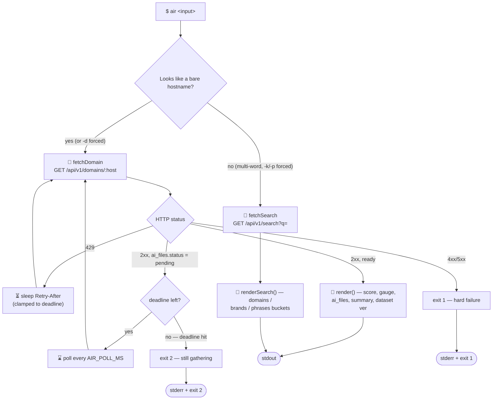
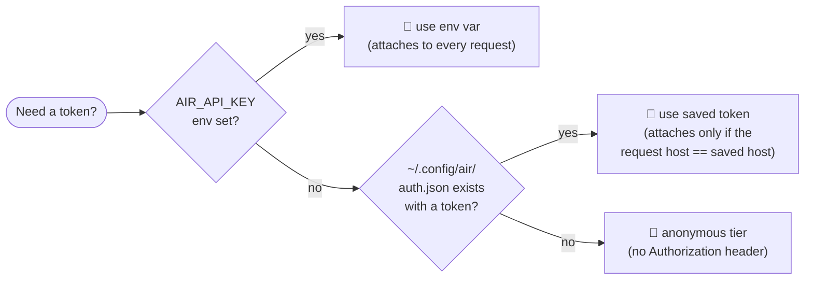

# 🏆 air (Go)

<div align="center">

**The Go build of `air` — a single-binary CLI that puts AI optimization in your terminal.**

[](https://go.dev/)
[](https://github.com/airanks-net/go-cli)
[](go.mod)
[](LICENSE)
[](https://airanks.net)

</div>

---

## 🤔 What is AIR?

**AIR** (Artificial Intelligence Ranking) by **[airanks](https://airanks.net)** makes **AI optimization** visible — a 0–10 score for how discoverable and citeable any domain is inside AI-generated answers. Look up any site's AIR score at **[airanks.net](https://airanks.net)**, or install the toolbar at **[airanks.net/toolbar](https://airanks.net/toolbar)** to see it while you browse.

`air` is the **Go** client — a zero-dependency, single-binary port of the same CLI that ships for Node and Rust. Same public API, same output, same shared login. Pick whichever runtime you already have installed. 🐹

---

## 📋 Table of Contents

- [What is AIR?](#-what-is-air)
- [Why the Go build?](#-why-the-go-build)
- [Install](#-install)
- [Quick start](#-quick-start)
- [How a lookup works](#-how-a-lookup-works)
- [Commands](#-commands)
- [Flags](#-flags)
- [Environment variables](#-environment-variables)
- [Exit codes](#-exit-codes)
- [🔐 Shared authentication](#-shared-authentication)
- [Output formats](#-output-formats)
- [Auto-update](#-auto-update)
- [Development](#-development)
- [The rest of the AIR family](#-the-rest-of-the-air-family)
- [License](#-license)

---

## ⚡ Why the Go build?

| | |
|---|---|
| 📦 **Single static binary** | `go install` or `go build` — no runtime, no `node_modules`, no interpreter to babysit |
| 🪶 **Zero dependencies** | `go.mod` pulls in nothing but the standard library — check it yourself, it's three lines |
| 🌈 **Full terminal experience** | Truecolor score gauge, Nerd Font icons, clickable OSC 8 hyperlinks — with automatic plain-text fallback for CI/pipes |
| 🔁 **Self-updating** | Once a day, on an interactive run, it checks GitHub Releases and upgrades itself via `go install` |
| 🤝 **Wire-compatible** | Same JSON envelope, same auth file, same exit codes as the Node and Rust clients — swap runtimes without changing scripts |

---

## 📥 Install

```bash
go install github.com/airanks-net/go-cli@latest
```

That drops an `air` binary in `$(go env GOPATH)/bin` — make sure it's on your `PATH`. Requires **Go 1.22+**.

<details>
<summary>🛠️ Building from a clone instead</summary>

```bash
git clone https://github.com/airanks-net/go-cli.git
cd go-cli
go build -o air .
```

No `go.sum` to fetch — the module has zero external requires, so `go build` finishes almost as fast as it starts. ⚡

</details>

---

## 🚀 Quick start

```bash
# Look up a domain's AIR score
air example.com

# Search by brand or phrase instead of a domain
air "best crm software"

# Force domain vs. keyword search explicitly
air -d example.com
air -k "project management tools"

# Machine-readable output for scripts
air example.com --json

# Plain text — no color, no icons (also auto-detected for CI/TERM=dumb)
air example.com --txt
```

A domain that's never been looked up before gets **gathered on the spot** — the CLI polls automatically until the result is ready (usually well under a minute, occasionally longer on a cold first hit). Cached domains return instantly. ⚡

---

## 🧭 How a lookup works



Every request carries a `User-Agent: air-go/1.0.0 (+https://airanks.net)` header and, when a token resolves and its host matches the API base, a `Bearer` `Authorization` header. `lookup()` polls against a single wall-clock deadline (`AIR_POLL_MAX_MS`) — both pending-status polls and 429 back-off sleeps count against the same budget.

---

## 🎛️ Commands

| Command | What it does |
|---|---|
| `air <domain\|keyword>` | Look up a domain's AIR score, or search domains/brands/phrases if the input isn't a bare hostname |
| `air login` | Authenticate — paste an API key, or log in via your browser (PKCE device flow) |
| `air logout` | Delete the locally saved token (server-side token stays valid until it expires) |
| `air whoami` | Show who you're logged in as, which tier, and token expiry if known |

> 🧙 **First-run wizard:** the very first time you run `air` interactively with no saved credential, it offers the same login choice as `air login` — plus a "continue without signing in" option — so you're never hard-gated. It never fires for `--json`, piped input/output, or once *any* auth file (including an anonymous marker) exists.

---

## 🏳️ Flags

| Flag | Description |
|---|---|
| `-d`, `--domain` | Force domain lookup |
| `-k`, `--keyword`, `-p`, `--phrase` | Force keyword/phrase search |
| `--json` | Emit raw JSON instead of formatted output |
| `--txt` | Plain text — no ANSI color or icons |
| `-h`, `--help` | Show usage |

---

## 🌱 Environment variables

| Variable | Purpose | Default |
|---|---|---|
| `AIR_API_KEY` | API key — takes priority over any saved login | *(none)* |
| `AIR_API_BASE` | Override the API base URL | `https://airanks.net/api/v1` |
| `AIR_POLL_MS` | Polling interval while a first-time lookup is gathering | `20000` |
| `AIR_POLL_MAX_MS` | Total deadline for a lookup before giving up | `180000` |
| `AIR_NO_UPDATE` | Disable the once-a-day auto-update check | *(unset)* |
| `NO_COLOR` | Disable ANSI color only — icons stay | *(unset)* |
| `COLUMNS` | Override detected terminal width for wrapping (no `ioctl`, so this or an 80-col guess) | *(auto)* |

`--txt` also engages automatically when `TERM=dumb` or `CI=true` — full plain path, no ANSI, no icons. `NO_COLOR` is narrower: color only, icons stay.

---

## 🚦 Exit codes

| Code | Meaning |
|---|---|
| `0` | ✅ Success |
| `1` | ❌ Hard failure — bad input, auth error, or a rate limit that outlasted the poll deadline |
| `2` | ⏳ Domain is still being gathered — re-run in a bit |

---

## 🔐 Shared authentication

**One login works across every AIR client.** `air login` here also logs in `air-cli` (Node), the Rust `air` client, and any tool using the `airanks-net/api-client` PHP package — they all read and write the **same** `~/.config/air/auth.json`, byte-for-byte identical shape, on purpose.

Token resolution order (identical in every client, checked fresh on every request):



```
AIR_API_KEY env  >  ~/.config/air/auth.json  >  anonymous
```

Two ways to authenticate, both reachable from `air login` or the first-run wizard:

1. **Paste an API key** — `GET /user` with the key as a Bearer token verifies it, then it's saved.
2. **Log in via browser** — a zero-dependency PKCE (RFC 7636, S256) device flow: the CLI generates a code verifier/challenge, opens `POST /cli/auth`, prints a confirmation code + URL (auto-opening the browser locally, printing the URL only over SSH or on a headless box), and polls `POST /cli/auth/poll` until you confirm.

The saved token only rides along on requests whose host matches the host you logged in against — so a stray `AIR_API_BASE` pointed elsewhere never leaks it. `AIR_API_KEY` attaches unconditionally, by design (that's what CI wants). Logging out (`air logout`) only deletes the local file; the token itself stays valid server-side until it naturally expires.

---

## 📤 Output formats

**Formatted (default)** — truecolor score gauge, Nerd Font icons (blank in `--txt` mode), a clickable `airanks.net/page?d=...` hyperlink (OSC 8, works in iTerm2/kitty/Ghostty/WezTerm), and — when the domain is tracked — the `llms.txt` / `llms-full.txt` / `ai.txt` / `robots.txt` / `json-ld` signals plus a color-coded AI-crawler-agent breakdown (allowed/partial/blocked).

**`--json`** — the raw API response body, pretty-printed. Shape:

```jsonc
{
  "hostname": "example.com",
  "air_score": 7.2,
  "percentile": 0.08,
  "tracked": true,
  "occurrences": 412,
  "phrases_count": 38,
  "brands_count": 19,
  "summary": "…",
  "ai_files": {
    "status": "ready",
    "llms_txt": true,
    "llms_full_txt": true,
    "ai_txt": false,
    "robots_txt": true,
    "json_ld": true,
    "json_ld_types": ["Organization"],
    "robots_ai_agents": { "GPTBot": "allowed", "CCBot": "blocked" }
  }
}
```

**`--txt`** — the same formatted layout with all color and icons stripped, for logs, CI, and dumb terminals.

---

## 🔄 Auto-update

On an interactive run (never for `--json`, piped, or `--txt` sessions), `air` checks GitHub Releases for `airanks-net/go-cli` **at most once every 24 hours**, stamping the check in `~/.config/air/update-check.json`. If a newer version is out, it self-upgrades with `go install github.com/airanks-net/go-cli@latest` and tells you to re-run. Any network hiccup, parse failure, or spawn error is swallowed silently — a lookup is never blocked or broken by the update path.

Opt out anytime with `AIR_NO_UPDATE=1`.

---

## 🧑‍💻 Development

```bash
go build ./...   # compile
go vet ./...     # lint
go test ./...    # run the test suite
```

`air_test.go` covers hostname normalization, token-attach host-matching, PKCE determinism/URL-safety, the first-run-wizard gate, and pending-status detection.

---

## 🌐 The rest of the AIR family

Every client shares the same API, the same `~/.config/air/auth.json`, and the same score.

| Repo | What it is |
|---|---|
| 🟦 [`node-cli`](https://github.com/airanks-net/node-cli) | The Node.js build of this same CLI |
| 🦀 [`rust-cli`](https://github.com/airanks-net/rust-cli) | The Rust build of this same CLI |
| 🐘 [`composer-package`](https://github.com/airanks-net/composer-package) | `airanks-net/api-client` — PHP client library |
| 🌍 [`chrome-extension`](https://github.com/airanks-net/chrome-extension) | The [airanks toolbar](https://airanks.net/toolbar) browser extension |
| 🔌 [`mcp-server`](https://github.com/airanks-net/mcp-server) | MCP server for wiring AIR into any MCP-speaking agent |
| 🧰 [`agent-toolkit`](https://github.com/airanks-net/agent-toolkit) | Universal toolkit teaching any AI agent/harness to use AIR |
| 📦 [`js-sdk`](https://github.com/airanks-net/js-sdk) | `@airanks-net/sdk` — TypeScript/JS SDK |
| 🐍 [`python-sdk`](https://github.com/airanks-net/python-sdk) | Python SDK |
| 🍺 [`homebrew-tap`](https://github.com/airanks-net/homebrew-tap) | `brew install` formulae for the CLIs |

---

## 📜 License

MIT — see [LICENSE](LICENSE).

<div align="center">

*Made with 🐹 and a suspicious amount of Nerd Font icons.*

</div>
